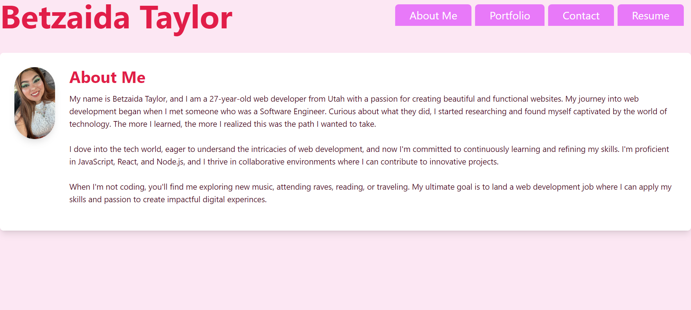

# Betzaida-Taylor-Portfolio

## Description
Hi! My name is Betzadia and this is my portfolio. Feel free to explore it. Check out the about me section to learn about me. Portfolio holds my projects I have created and collaborated on. Send me an email in the contact section or download my resume.

## Technologies Used
Javascript (ES6+), React.js, Vite, Tailwind CSS, HTML5, CSS3, JSX, Node.js, and npm.

## Installation
If you would like to use my portfolio as a template for yours follow the steps below.
1. Clone the repository: git clone https://github.com/yourusername/Betzaida-Taylor-Portfolio.git
2. cd into the project
3. run npm install
4. npm run dev

## Usage
1. Navigate around the website by clicking on the tabs
2. On the Portfolio tab, view my repositories, or my deployed sites by clicking on the view code or view site
3. Contact me by filling out your name and email and sending a message
4. Download my resumen by clicking on the link

## Contributing
If you would like to contribute to this project, please fork the repository and submit a pull request with any changes.

## License
This project is not licensed.

## Links
Github: https://github.com/Betzaida96/Betzaida-Taylor-Portfolio

Netlify: 

## Photos
